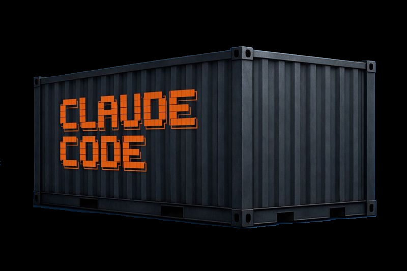

# ccc - Claude Code Container
<p align="center">
  
</p>


<p align="center">

[](https://claude.ai)
[](https://www.docker.com/)
[](https://podman.io/)
[](https://www.gnu.org/software/bash/)
[](https://github.com/charmbracelet/gum)

</p>

CLI for running Claude Code in isolated containers, so you can use --dangerously-skip-permissions without feeling guilty

## Why?

Claude Code's `--dangerously-skip-permissions` flag (what I've chosen to call *godmode* in the context of this tool) lets Claude execute commands without manual approval - great for automation, but risky on your main system. Since I love containers and they are so simple to work with, I chose this over just running claude instances on a VM.

By creating a container based on nix, which can use the `nix-shell` to run tools that are not pre-downloaded, we can (along with some claude prompting or claude config/memory) let claude use a bunch of different tools, without having to know of them beforehand.


## Quick Start

```bash
# Run a one-off prompt with godmode
ccc new -g -p "create a hello world python script"

# Start an interactive session
ccc new -ig

# List running containers
ccc list

# Attach to an existing session
ccc attach -n <container-name>

# Stop a container
ccc stop -n <container-name>
```

## Requirements

| Dependency | Required | Description |
|------------|----------|-------------|
| [Claude Code](https://docs.anthropic.com/en/docs/claude-code) | Yes | The CLI tool this wraps |
| [Docker](https://docs.docker.com/get-docker/) | One of | Container runtime |
| [Podman](https://podman.io/getting-started/installation) | One of | Container runtime |
| [gum](https://github.com/charmbracelet/gum) | Yes | Terminal UI components |

## Installation

### Quick Install (Recommended)

```bash
curl -fsSL https://raw.githubusercontent.com/arch-err/ccc/refs/heads/main/install.sh | bash
```

This will:
1. Clone the repository to `~/.local/share/ccc`
2. Run the interactive installer (detects runtimes, checks dependencies)
3. Create symlink at `~/.local/bin/ccc`

### Manual Install

```bash
git clone https://github.com/arch-err/ccc.git ~/.local/share/ccc
cd ~/.local/share/ccc
make install
```

### Pull Container Image

After installation, pull the pre-built container:

```bash
# With Podman
podman pull ghcr.io/arch-err/ccc:latest

# With Docker
docker pull ghcr.io/arch-err/ccc:latest
```

Or build it locally:

```bash
cd ~/.local/share/ccc
make build
```

## Usage

### Create a New Container

```bash
# Basic usage - headless mode with a prompt
ccc new -p "your prompt here"

# With godmode (auto-approve all actions)
ccc new -g -p "your prompt here"

# Interactive mode (opens claude TUI)
ccc new -g -i

# Specify working directory
ccc new -g -d /path/to/project -p "analyze this codebase"

# Custom container name
ccc new -g -n my-project -p "your prompt"
```

### Manage Containers

```bash
# List all ccc containers
ccc list

# Attach to a running container
ccc attach -n <name>

# Stop a container
ccc stop -n <name>

# Start a stopped container
ccc start -n <name>

# View container logs
ccc logs -n <name>
ccc logs -n <name> -f  # follow mode

# Execute commands in a container
ccc exec -n <name> -- ls -la
ccc exec -n <name>  # opens a shell
```

## How It Works

1. **Container Creation**: Mounts your project directory and `~/.claude` credentials
2. **LD_PRELOAD Magic**: A tiny library fakes uid/gid syscalls, making Claude think it's non-root
3. **Root File Access**: Actually runs as root inside container, so all mounted files are accessible
4. **Session Persistence**: Sessions are stored and can be resumed with `ccc attach`

See [DOCUMENTATION.md](DOCUMENTATION.md) for technical details.

## Advanced Isolation

`ccc` provides multiple layers of isolation for security-conscious users who want to run Claude Code in highly controlled environments.

### Clean Sessions (`-c/--clean`)

Create ephemeral workspaces that don't clutter your projects:

```bash
# Temporary project directory in /tmp/ccc/tmpXXXXXX
ccc new -igc

# Great for one-off experiments
ccc new -gc -p "create a test script"
```

The directory is created automatically and shown in `ccc list`. Useful for throwaway experiments without leaving traces in your home directory.

### Anonymous Mode (`-a/--anonymous`)

Run Claude without mounting your credentials or configuration:

```bash
# No ~/.claude or ~/.claude.json mounted
ccc new -iga

# Requires re-authentication inside the container
# No access to your conversation history or custom commands
```

This creates a completely fresh Claude environment with no connection to your identity.

### Network Isolation (`--network`)

Override the default host networking for complete network control:

```bash
# Use a custom Docker/Podman network
ccc new -ig --network my-isolated-net

# Combine with other isolation flags
ccc new -igca --network air-gapped-net
```

### Maximum Isolation

For the most secure setup, combine all isolation features:

```bash
ccc new -igca --network isolated-net
```

This creates:
- **Clean workspace**: Temporary directory, no project file access
- **Anonymous session**: No credentials or history
- **Network isolated**: Custom network with controlled egress

#### Example: Isolated Network Setup

Create a network that only allows access to Claude's API:

```bash
# Create isolated network (Docker)
docker network create \
  --driver bridge \
  --subnet 172.30.0.0/24 \
  claude-isolated

# Add firewall rules (iptables example)
# Allow only api.anthropic.com (resolve IPs first)
iptables -I DOCKER-USER -s 172.30.0.0/24 -d api.anthropic.com -j ACCEPT
iptables -I DOCKER-USER -s 172.30.0.0/24 -j DROP

# Run fully isolated session
ccc new -igca --network claude-isolated
```

This gives you a Claude session that:
- Cannot access your local files
- Cannot access your credentials
- Can only reach Anthropic's API
- Leaves no traces after cleanup

Perfect for running untrusted code generation or sensitive experiments.

## Files

- `ccc` - Main CLI script
- `Dockerfile` - Container image definition (based on nixos/nix)
- `entrypoint.sh` - Container entrypoint handling user setup

## License

MIT License - see [LICENSE](LICENSE) for details.
