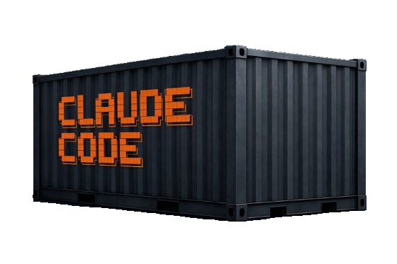

# ccc - Claude Code Containers



<p align="center">

[](https://claude.ai)
[](https://www.docker.com/)
[](https://podman.io/)
[](https://www.gnu.org/software/bash/)
[](https://github.com/charmbracelet/gum)

</p>

CLI for running Claude Code in isolated containers, so you can use `--dangerously-skip-permissions` without feeling guilty.

## Why?

Claude Code's `--dangerously-skip-permissions` flag (what I've chosen to call *godmode* in the context of this tool) lets Claude execute commands without manual approval - great for automation, but risky on your main system. Since I love containers and they are so simple to work with, I chose this over just running Claude instances on a VM.

By creating a container based on nix, which can use the `nix-shell` to run tools that are not pre-downloaded, we can (along with some Claude prompting or Claude config/memory) let Claude use a bunch of different tools, without having to know of them beforehand.

## Quick Start

```bash
# Run a one-off prompt with godmode
ccc new -g -p "create a hello world python script"

# Start an interactive session
ccc new -ig

# List running containers
ccc list

# Attach to an existing session
ccc attach -n <container-name>

# Stop a container
ccc stop -n <container-name>
```

## How It Works

1. **Container Creation**: Mounts your project directory and `~/.claude` credentials
2. **LD_PRELOAD Magic**: A tiny library fakes uid/gid syscalls, making Claude think it's non-root
3. **Root File Access**: Actually runs as root inside container, so all mounted files are accessible
4. **Session Persistence**: Sessions are stored and can be resumed with `ccc attach`

## Requirements

| Dependency | Required | Description |
|------------|----------|-------------|
| [Claude Code](https://docs.anthropic.com/en/docs/claude-code) | Yes | The CLI tool this wraps |
| [Docker](https://docs.docker.com/get-docker/) | One of | Container runtime |
| [Podman](https://podman.io/getting-started/installation) | One of | Container runtime |
| [gum](https://github.com/charmbracelet/gum) | Yes | Terminal UI components |

## Next Steps

- [Installation](installation.md) - Get ccc set up on your system
- [Usage](usage.md) - Learn how to create and manage containers
- [Isolation](isolation.md) - Advanced isolation features for security
- [CLI Reference](reference/cli.md) - Complete command documentation
